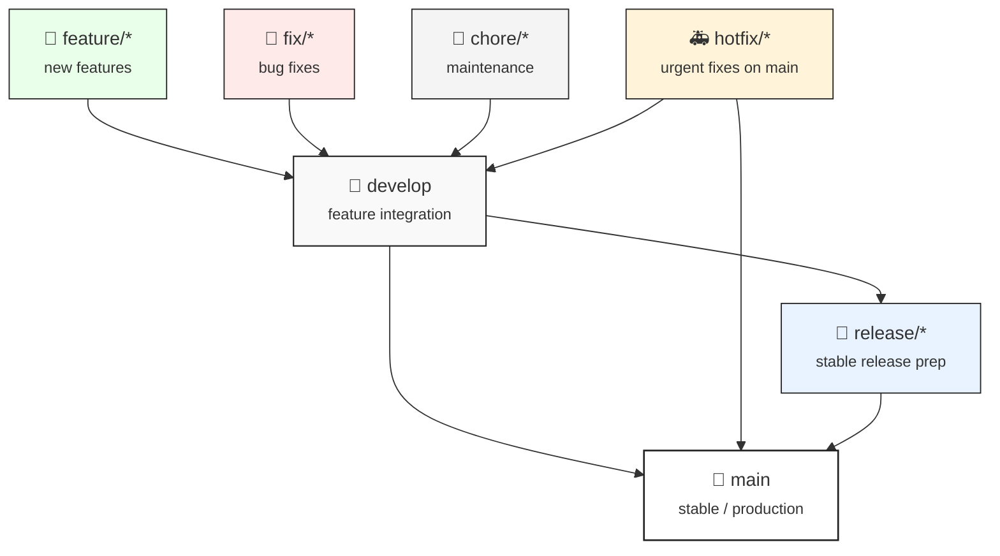
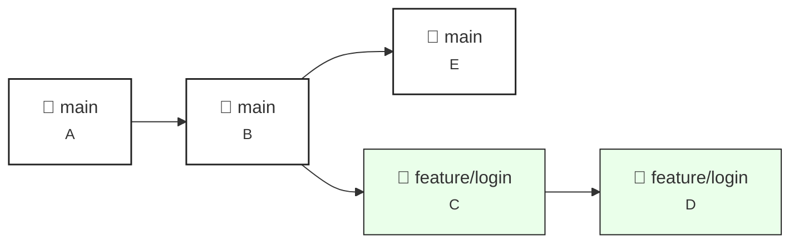
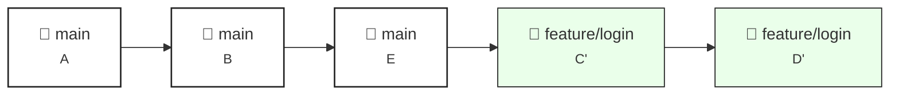
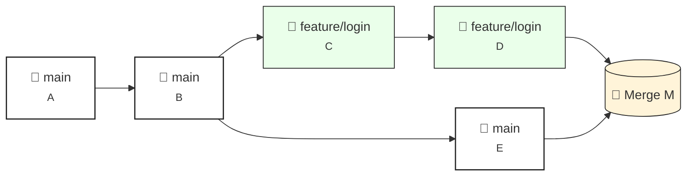

<p align="center">
  
</p>

---

## Recommended Git workflow for `synapseTools`

This document explains how we work with Git in this project to keep history clean, enable collaboration without conflicts, and allow anyone to perform merges (there may be a designated person, but we want the process to be accessible).

Everyone is assumed to have Git configured and access to the remote repository. If not, ask the infrastructure lead to grant access.

> Note: This workflow is prepared to integrate CI/CD pipelines in the future, while remaining compatible with automated deployments.

---

### 1. General rules

- Always work from feature/bugfix/refactor or release branches, never directly on `main`.
- `main` must always reflect a stable version that can be deployed.
- Use small, atomic commits with clear imperative messages: "Add validation X", "Fix bug in Y".
- Before pushing, update your local branch with the remote base branch (see below) and run tests/linter if applicable.
- Merges to `main` are done via Pull Requests (PR) reviewed by at least one person. If there is a designated merge person, they follow the same procedure, but anyone can do it if authorized.

---

### 2. Branch naming convention

- `main` — stable / production branch.
- `develop` — (optional) integration branch for features in development (multiple features to integrate).
- `release/<version>` — preparation of stable releases.
- `feature/<short-description>` — new features.
- `fix/<short-description>` — bug fixes.
- `chore/<short-description>` — maintenance tasks.
- `hotfix/<short-description>` — urgent fixes directly on `main`.

Examples:

```
feature/login-oauth
fix/fetch-timeout
chore/update-deps
```



---

### 3. Typical workflow for developing a feature (local)

1. Sync `main` and create your branch from `main`:

```bash
>>> git checkout main
>>> git pull origin main
>>> git checkout -b feature/descriptive-name
```

2. Work on the branch, make atomic commits:

```bash
>>> git add <files>
>>> git commit -m "Add: brief description in imperative"
```

> Commits should always be written in imperative mood (as if giving an order) and be atomic—each representing a small, clear, coherent change.
> The title should indicate what the change does, not why or how.

```bash
Examples:

>>> git commit -m "Add: endpoint to fetch user statistics"
>>> git commit -m "Fix: error loading data from CSV"
>>> git commit -m "Refactor: text cleaning function"
>>> git commit -m "Update: README documentation"
>>> git commit -m "Optimize: database queries"
```

3. First push and set-upstream (configures remote branch):

```bash
>>> git push -u origin feature/descriptive-name
```

4. Keep your branch updated with `main` while developing (rebase or merge):

Option A — rebase (cleaner history):

```bash
>>> git fetch origin
>>> git checkout feature/descriptive-name
>>> git rebase origin/main
>>> # resolve conflicts if any, then:
>>> git rebase --continue
>>> # finally force push because you rewrote local history
>>> git push --force-with-lease origin feature/descriptive-name
```

#### Before rebase



#### After rebase



Option B — merge (simpler):

```bash
>>> git fetch origin
>>> git checkout feature/descriptive-name
>>> git merge origin/main
>>> # resolve conflicts, merge commit
>>> git push origin feature/descriptive-name
```

#### Before merge


#### After merge



Recommendation: use rebase to keep history linear and clean. Use `--force-with-lease` instead of `--force` to avoid overwriting unexpected remote work.

---

### 4. Opening a Pull Request (PR)

1. Push your branch to remote:

```bash
>>> git push origin feature/descriptive-name
```

2. On the hosting platform (GitHub/GitLab/Bitbucket):
- Open a PR into `main` (or `develop` if used).
- Include a clear description: what it does, why, how to test it, snapshot/artifacts if applicable.
- Add reviewers and labels (bug, enhancement, etc.).
- Wait for approvals and resolve comments.

---

### 5. Final merge (detailed steps for whoever performs the merge)

This procedure is designed so anyone can do it safely.

1. Before merging, from the remote base branch (`main`) fetch and update it locally:

```bash
>>> git checkout main
>>> # Recommended: keep linear history locally
>>> git pull --rebase origin main
```

2. Fetch the feature branch locally if it doesn't exist:

```bash
>>> git fetch origin
>>> git checkout -b feature/descriptive-name origin/feature/descriptive-name
```

3. Update the feature branch with `main` (rebase recommended):

```bash
>>> git checkout feature/descriptive-name
>>> git rebase origin/main
>>> # resolve conflicts if any, then finish rebase
>>> git rebase --continue
```

4. Run tests/linter locally and verify everything is ok.

5. Push the updated branch (may require safe force):

```bash
>>> git push --force-with-lease origin feature/descriptive-name
```

6. On the hosting platform, complete the PR with the team's preferred "Merge" option. We recommend "Squash and merge" or "Merge commit" per team policy:

- Squash and merge: keeps `main` with ordered commits and one commit per PR.
- Merge commit: preserves individual commits.

7. After merging, update local `main` and delete remote and local branch:

```bash
>>> git checkout main
>>> git pull origin main
>>> git push origin --delete feature/descriptive-name
>>> git branch -d feature/descriptive-name
```

If the local branch cannot be deleted because it's not fully merged, use `git branch -D feature/descriptive-name` with care.

---

### 6. What to do if there are complex conflicts or dirty history

- If a conflict appears during rebase, Git will mark conflicting files. Edit the files, test locally, then:

```bash
>>> git add <resolved-files>
>>> git rebase --continue
```

- If the rebase fails and you want to return to the previous state:

```bash
>>> git rebase --abort
```

- Never use `reset --hard` to sync shared branches on the remote. If you need to force something on the remote, coordinate with the team and prefer `--force-with-lease`.

---

### 7. Recovering lost work or cleaning history in a new repo (migration case)

If you are creating a new repository to "clean" history, follow these minimal steps:

1. Create a new repo on the platform (e.g. GitHub) and clone it empty or add the remote.
2. In the current repo, create a branch containing the state you want to preserve (e.g. `clean-start`):

```bash
>>> git checkout --orphan clean-start
>>> git add -A
>>> git commit -m "Initial clean commit: current project state"
>>> git push origin clean-start
```

3. In the new repo, pull or push `clean-start` as `main` and force if needed (coordinate with the team):

```bash
>>> # in the new cloned repo
>>> git checkout -b main
>>> git pull <old-repo-url> clean-start
>>> git push origin main
```

Or alternatively, from the old repo push `clean-start` to the new remote directly:

```bash
>>> git remote add new-origin <new-repo-url>
>>> git push new-origin clean-start:main
```

Note: These steps create a clean history and start from scratch with a single commit representing the current state of the code.

> ⚠️ Warning: This creates a new history. Should not be done without coordination, as it destroys traceability of previous commits.

---

### 8. Quick checklist before merging (for whoever does it)

- [ ] PR approved by at least 1 reviewer.
- [ ] Pipeline/CI passes (tests, linter, build) or manual verification if no CI.
- [ ] Rebase/merge with `main` and local conflict resolution.
- [ ] Local tests performed (unit, minimal integration).
- [ ] Clear merge/PR message and link to issue (if applicable).

---

### 9. Suggested Pull Request template

Using a template facilitates consistent reviews. Create a file `.github/PULL_REQUEST_TEMPLATE.md` with the following suggested content:

```
## Description
- What changes does this PR include?
- Why are they needed?

## How to test
- Steps to reproduce / verify the changes

## Checklist
- [ ] Tests pass
- [ ] Linter passes
- [ ] Documentation updated if applicable

## Related issues
- Closes #<issue-number>
```

This helps the person merging to have all the necessary information.

---

### 10. Guidelines for when new people join

- Document conventions (branch names, commits) in this file.
- Do a short onboarding: show examples of PRs, merges, and conflict resolution.
- Assign roles: reviewer, release manager (optional).
- Maintain communication: Discord/Slack/Teams to coordinate merges that may affect other branches.

---

### 11. FAQ

Q: Can I use `git pull` without arguments?
A: Prefer `git pull --rebase` or `git fetch && git rebase origin/<branch>` to avoid unwanted automatic merges.

Q: Why `--force-with-lease` instead of `--force`?
A: `--force-with-lease` checks that the remote hasn't changed since your last fetch; it prevents accidentally overwriting someone else's work.

Q: What if I broke something in `main`?
A: Revert the problematic commit with `git revert <sha>` and deploy a hotfix if needed. Avoid rewriting public history.

---

### 12. Useful resources

- [Git book](https://git-scm.com/book/en/v2)
- [GitHub](https://docs.github.com)
- [Conventional Commits](https://www.conventionalcommits.org/en/v1.0.0/)

---

Author: synapse.ai
